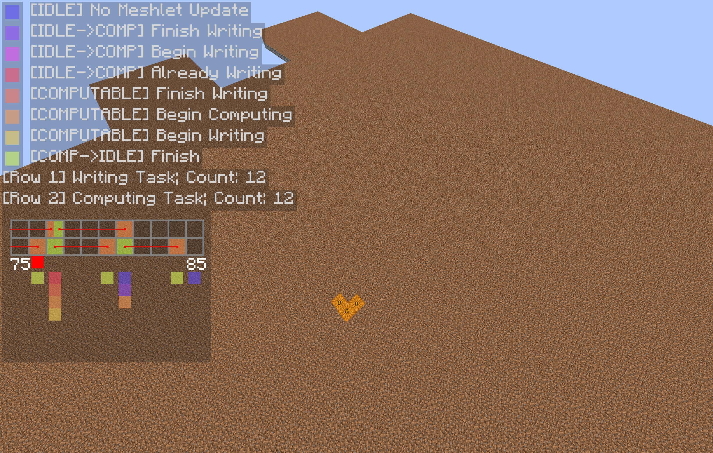

## Feb 2026
**Want To Implement:**
- Terrain meshlet double buffering
- Meshlet write → compute → fully programmable vertex pulling _(i)_
- Expand the _(i)_ pipeline to opaque/transparent/cutout
- Block udpate notify
- On demand compute; in place rewrite

**Follow-up Tasks:**
- GL test framework
- Full texture abstraction including DSA and 1D 2D 3D 2DArray etc.
- Shader debug framework including macro injection etc.

**Future To-Dos:**
- Migrate to visibility buffer for terrain rendering
- SDF AO

**Done:**
- Implement the terrain meshlet double buffering pipeline
  - 2 buffers for meshlet data read (read by compute) and write (write from cpu)
  - 2 buffers for compute data read (read by draw calls) and write (write from gpu)
- Fix terrain meshlet double buffering lifecycle issue
- Add terrain meshlet double buffering lifecycle debug hud
  
- Remove interface `I` prefix
- Implement GL junit test extensions

## March 2026
**Done:**
- Refactor & implement texture abstraction: `GLTexture` + `Accessor`
- Replace SSBO counter by uimage1D
- Basic shader debug infra

**Want To Investigate:**
- Crash due to compute shader debug
- Why `Meshlet.blockCount == 0` for some compute shader calls
- Whether GPU side meshlet vertex/index data follow the slot layout

**3.31 Snapshot:**
- Currently working on the "On demand compute; in place rewrite"
  - In order reduce the amount of compute shader's work, 
    meshlet vertex/index output will follow a slot memory layout 
    (`|Slot 0: data ... padding|Slot 1: ...` where every slot has the same length, so in place rewrite will be possible)
- Issue: `Meshlet.blockCount == 0` for some compute invocations while there's no empty meshlet on CPU side
- Issue: shader debug infra causes crash (system freeze) due to an unknown issue
- Need to verify that meshlet vertex/index output is working correctly and following a slot layout
- Need another SSBO to record indices to guide VS vertex pulling

## April 2026

**Debugging**:
- **Actual cause**: UNKNOWN<br>
  `MeshletBufferWriteJob.execute` didn't run (due to the lack of data) for the first write task; therefore `Meshlet.blockCount == 0` for the first compute dispatch.
  However, a `write --> then --> compute` lifecycle is guaranteed. Issue might be stemmed from the ECS job related stuff.
- **Potential race condition**<br>
  `CleanWorld.update`, which is flushing the ecs commands, may run while `job.executeAsync` is running.
  As a result, archetype data may be modified while a job is reading it.
  Creating snapshots might be too expensive, so I may delay `CleanWorld.update` based on the current job status
  ```java
  if (!system1.isExecuting() && !system2.isExecuting() ...) {
      super.update();
  }
  ```
  But it looks less elegant since systems/jobs inside a `CleanWorld` will require manual managements.
  It still makes sense if we aim to provide a low level ECS.
- **Guess**<br>
  The potential ECS race condition might be the cause of `Meshlet.blockCount == 0` but
  the empty meshlet issue only happens for the first compute dispatch. The consistency makes this thing more suspicious.
  Race conditions might not be consistent like that.
- **Guess**<br>
  Shader debug was causing system freeze and crash likely because I didn't allocate enough
  storage for buffers? Btw I shouldn't assume that debug data stay together for every frame since `append log` was called async.
