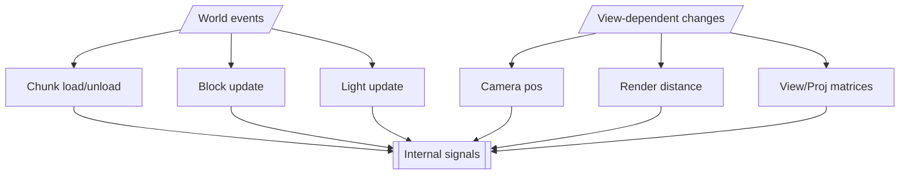

# Terrain Rendering Related Data Flow

> Relevant classes:
>  · `com.cleanroommc.kirino.KirinoCore`
>  · `com.cleanroommc.kirino.engine.render.scene.MinecraftScene`

> Relevant methods:
>  · `com.cleanroommc.kirino.KirinoCore#EntityRenderer$renderWorld`
>  · `com.cleanroommc.kirino.KirinoCore#RenderGlobal$notifyBlockUpdate`
>  · `com.cleanroommc.kirino.KirinoCore#RenderGlobal$notifyLightUpdate`
>  · `com.cleanroommc.kirino.engine.render.scene.MinecraftScene#update`

 

## Entry Points

## World State Synchronization (CPU-side)
On the CPU side, the world state is first mapped into the ECS world as entities and components.
- Each visible chunk is represented as ECS entities (`Entity: { ChunkComponent }`; `ChunkComponent` represents a _16x16x16_ region)
- Chunk ecs-entity creation and destruction are buffered and applied at a unified flush point every frame
- These entities describe what exists in the world, not how it should be rendered

> **The output of this stage is**: 
> A structured ECS world view that is consistent with the current Minecraft world state.
> (might show a small latency due to the unified flush point)

## CPU Orchestration: Deciding What Needs to Change
During each frame update, the CPU evaluates which conditions have changed:
- Whether the camera has moved far enough to affect chunk selection
- Whether the render distance has changed
- Whether new chunks have been added or existing chunks have been removed
- Whether GPU-side data needs to be reuploaded or rebuilt

These conditions do not directly trigger execution. Instead, they drive state machine (FSM) transitions, which determine
which pipeline stages should run next.

> **Key point**: 
> The CPU is responsible for deciding the flow, not for processing the data.

## Terrain & Meshlet Pipeline (CPU → GPU Boundary)
When the CPU determines that terrain data needs to be updated, the following stages are executed:
- Chunk Prioritization
  - Chunks are prioritized based on camera position (outward order)
- Meshlet Generation (CPU-side preparation)
  - Meshlet descriptors are generated for the selected chunks
- Meshlet Lifecycle Management
  - A CPU-side meshlet descriptor to GPU-side resource ID mapping is maintained
  - Prepare to upload meshlet data to GPU

These stages run as asynchronous system flows, with callbacks used to advance the FSM.

> **The output of this pipeline is**: 
> not _renderable objects_, but a structured set of meshlet data waiting to be written into GPU memory.

## GPU Data Preparation & Synchronization
Once meshlet data is ready on the CPU side:
- Data is written into GPU buffers
- Compute shaders further process the data on the GPU
- Explicit memory barriers and fences are used to guarantee visibility,
  avoiding conservative synchronization or implicit stalls

> **After this stage**: 
> the system becomes GPU-ready — all data required for rendering is resident in GPU memory.

## Rendering Execution (GPU-driven)
During rendering:
- The CPU no longer submits draw calls on a per-object basis (only for the terrain part!)
- Rendering relies on GPU-resident meshlet data
- The CPU is limited to triggering render passes

> **Key point**: 
> Once data enters the GPU, the execution path is kept on the GPU as much as possible.
