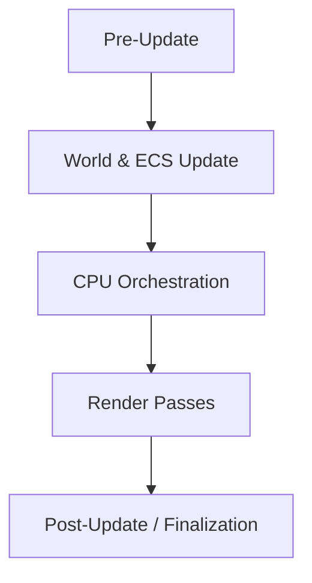

# Frame as the Primary Execution Unit

All rendering-related work is organized around 
a per-frame lifecycle with clearly separated phases.

Key properties:
- Frame execution is explicitly staged
- Cross-phase state changes are explicitly controlled

A single frame is conceptually divided into the following phases:

This structure is stable even if detailed implementations change.

## Pre-Update

The pre-update phase prepares the execution environment:
- Captures external graphics state
- Updates frame-dependent resources (resolution, framebuffers)
- Binds the main framebuffer

> **Key point**: 
> Pre-update must not perform heavy computation or data processing.

## World & ECS Update

During this phase, the engine updates world-related state:
- ECS worlds advance their internal state
- No rendering decisions are made at this stage

> **Key point**: 
> It's more about "what exists" instead of "what to render".

> **See**:
>  · `docs/data_flow.md`

## CPU Orchestration

CPU addresses what should happen. This includes:
- Evaluating view-dependent changes
- Advancing state machines that control asynchronous system flows

> **See**:
>  · `docs/data_flow.md`

## Render Passes

Several render passes will be run. Some of them are GPU-driven while some are still CPU-submitted.

Specifically:
- Most part of the terrain is rendered via a single dummy draw call, using a GPU-driven pipeline
- Entities are still rendered on a per-entity draw call basis, due to Minecraft's constraints

> **Note**: 
> This part is highly related to the concepts like `DrawCommand`, `RenderPass`, `Subpass`, etc.

## Post-Update

The post-update phase completes the frame:
- Multi-resolution (up-scaling or down-scaling) and post-processing
- Final framebuffer swap (blit the result to Minecraft's framebuffer)
- Restoring external graphics state

## Notes on Implementation Volatility
Readers should treat this document as the execution contract,
not as a direct reflection of current code layout.
