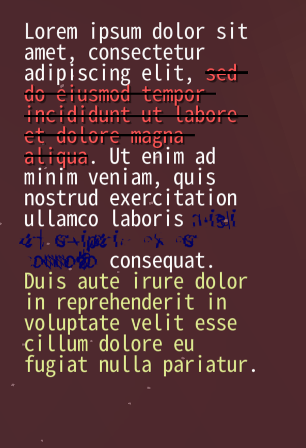

# Kirino Styled Text Specification

The Kirino Styled Text syntax is inspired by the Minecraft styled text syntax,
and its capability is strictly a superset of Minecraft styled text.

Just like regular Minecraft text it uses `§` as the control character. 
However, unlike the Minecraft text, it introduces span blocks (nested spans are allowed), 
which allow for an easy return to the previous style used.

## Span block syntax
The span block is defined as `§<style>[...]§`, where `style` are
the style hints and `...` is the text to be stylized.
The text returns to the previous style when the span block is closed.

The style hints can be separated into fields and flags,
fields are named and need values, and flags need to just be specified.
Names of fields and flags should be self-explanatory.

A field follows the syntax `<field name>=<field value>`.

A semicolon separates each style hint.

## Escape mechanism
`\` is treated as the escape character as usual. You need to write `\\` in a Java String to get a Kirino Styled Text level `\`.
Similarly, Java String `\\\\` = Kirino Styled Text `\\` = seeing an actual backslash being printed.

> Notice:
> For a generalized pattern `...§<style>[...]§...`,
> the escape character doesn't function in the `<style>` area.

### Escape examples
Java String: `\\§b[no longer styled]\\§`<br>
Kirino Styled Text: `\§b[not longer styled]\§`<br>
Rendered: `§b[not longer styled]§`

Java String: `\\A`<br>
Kirino Styled Text: `\A`<br>
Rendered: `A`

Java String: `\\\\A`<br>
Kirino Styled Text: `\\A`<br>
Rendered: `\A`

Java String: `abc\\§def`<br>
Kirino Styled Text: `abc\§def`<br>
Rendered: `abc§def`

## Fields

|          Field name           |  Field abbreviation  |         What is it?         |                                                                                                                                                                                   Value format |
|:-----------------------------:|:--------------------:|:---------------------------:|-----------------------------------------------------------------------------------------------------------------------------------------------------------------------------------------------:|
|      `color` or `colour`      |         `c`          |         Text color          |  Hexadecimal color code in the `#AARRGGBB` format, 8-bit color specified as `rgb(r;g;b)`, `argb(a;r,g;b)`, `rgba(r;g,b;a)` or floating point color `hsl(0⩽h⩽360;0⩽s⩽1;0⩽l⩽1)` or a named color |
|        `outline color`        |         `oc`         |        Outline color        |                                                                                                                                                                                    Named color |
|     `strikethrough color`     |        `ssc`         |     Strikethrough color     |                                                                                                                                                                                    Named color |
| `strikethrough outline color` |        `ssoc`        | Strikethrough outline color |                                                                                                                                                                                    Named color |
|       `underline color`       |         `uc`         |       Underline color       |                                                                                                                                                                                    Named color |
|            `size`             |         `s`          |          Font size          |                                                                                                                                                                           Floating point value |

The word `color` can be replaced with `colour` in any style hint.

## Flags

|        Flag name        | Flag abbreviation |                                             What is it? |
|:-----------------------:|:-----------------:|--------------------------------------------------------:|
|        `outline`        |        `o`        |                                            Text outline |
|         `bold`          |        `b`        |                                               Bold text |
|        `italic`         |        `i`        |                                             Italic text |
|       `underline`       |        `u`        |                                         Underlined text |
|   `underline shadow`    |       `ush`       |                                        Underline shadow |
|      `obfuscated`       |        `x`        |                                         Obfuscated text |
|     `strikethrough`     |       `ss`        |                                      Strikethrough text |
| `strikethrough outline` |       `sso`       |                                   Strikethrough outline |
| `strikethrough rounded` |       `ssr`       |                   Rounded corners of strikethrough line |
|        `shadow`         |       `sh`        |                                        Text with shadow |
|        `default`        |       `def`       | Reset text style to default (1.0 size, white, no flags) |

## How does Kirino deal with improperly written text?

If a span block is improperly written, the game will not crash or indicate an error.
Instead, an Undefined Behavior will occur. The text might stop rendering after the misshapen span block;
it might also result in a weird mix of styles from the previous blocks.

Either way, writing improperly formatted text will not cause errors, nor will it cause memory leaks in the game.
You still should not do this, though.

## Examples



### With full names

```
Lorem ipsum dolor sit amet, consectetur adipiscing elit, 
§color=red;strikethrough;shadow[sed do eiusmod tempor incididunt 
ut labore et dolore magna aliqua]§. Ut enim ad minim veniam, 
quis nostrud exercitation ullamco laboris §color=#FF000063;obfuscated[nisi 
ut aliquip ex ea commodo]§ consequat. 
§color=rgb(224;236;145)[Duis aute irure dolor in 
reprehenderit in voluptate velit esse cillum dolore eu 
fugiat nulla pariatur]§.
```

### With abbreviations

```
Lorem ipsum dolor sit amet, consectetur adipiscing elit, 
§c=red;ss;sh[sed do eiusmod tempor incididunt ut labore et 
dolore magna aliqua]§. Ut enim ad minim veniam, quis nostrud 
exercitation ullamco laboris §c=#FF000063;x[nisi ut aliquip ex 
ea commodo]§ consequat. §color=rgb(224;236;145)[Duis aute irure 
dolor in reprehenderit in voluptate velit esse cillum dolore eu 
fugiat nulla pariatur]§.
```